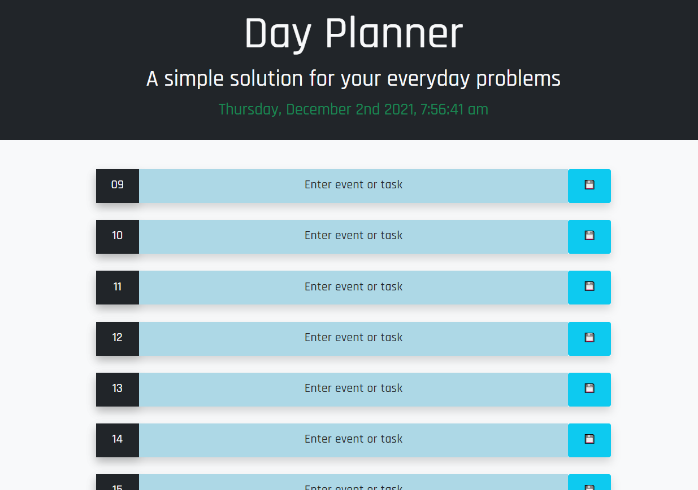

# Work-Day-Scheduler

The task was to create a simple calendar aplication that allowed to plan daily activities and be able to save them. This had to be done by using jQuery to achieve a dynamically update HTML and CSS.

First, the main HTML structure was created, including the tag where the calendar was going to be nested. I used Bootstrap directly on the HTML to give style to the few elements that were not going to be created in Javascript. After the HTML was done, I started the Javascript coding trying to use only jQuery. I started with the clock and added an update function. Later, I added a refresh function here for the colors of the calendar to change every hour. I created a base array for the Calendar objects and created the variables that I was going to need first. Then I worked on the function for rendering the calendar by creating the elements, adding styles with Bootstrap classes and CSS, and adding them to the base HTML. After that, I made sure that the elements were able to be saved and loaded to the local storage. When the Javascript was finished, I polished the webpage format with some CSS and Google Fonts. 

 [Final Product:Github repository](https://github.com/csancheze/Work-Day-Scheduler)

 [Final Product:Work Day Scheduler](https://csancheze.github.io/Work-Day-Scheduler/)
